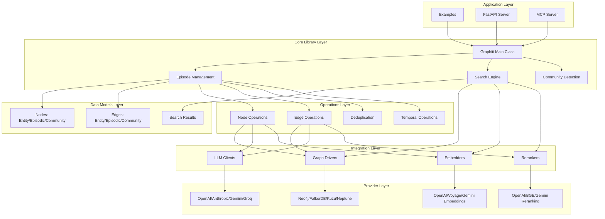
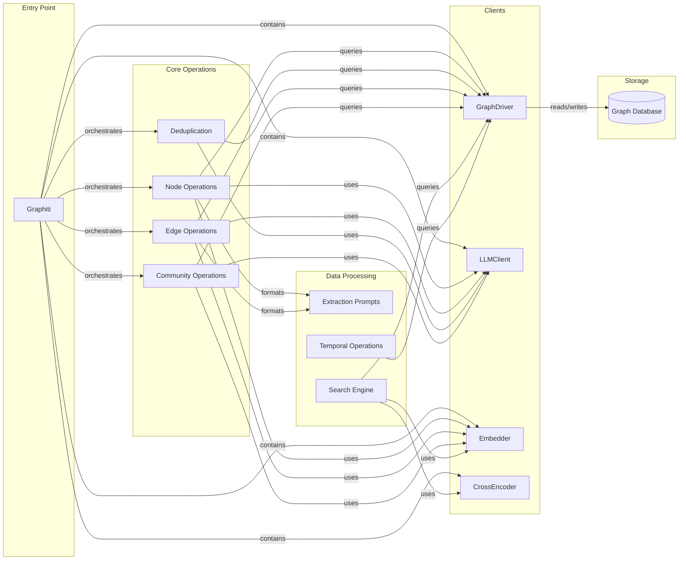
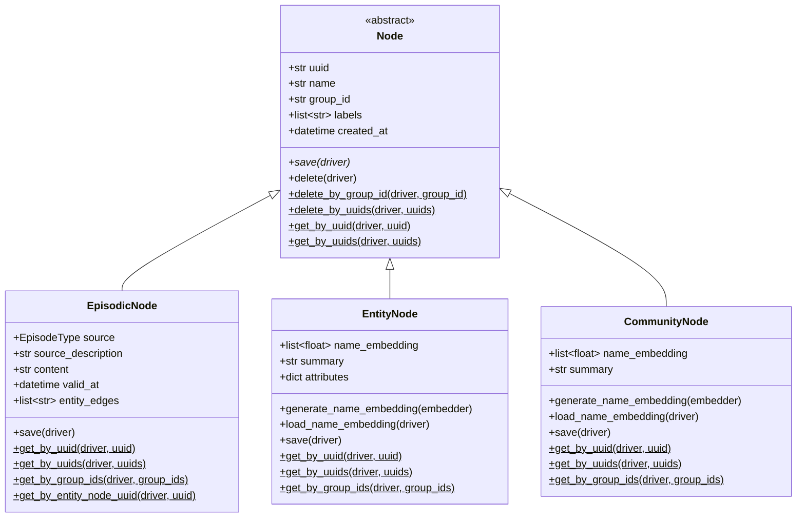
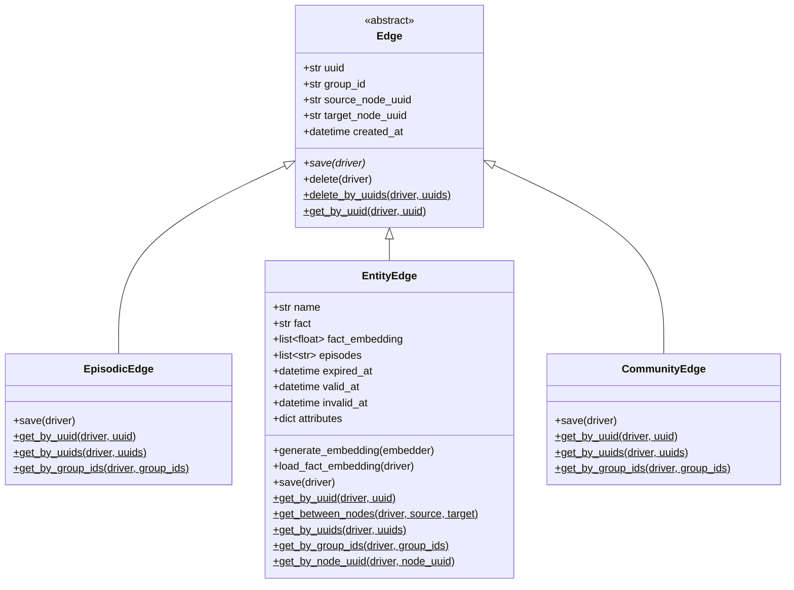
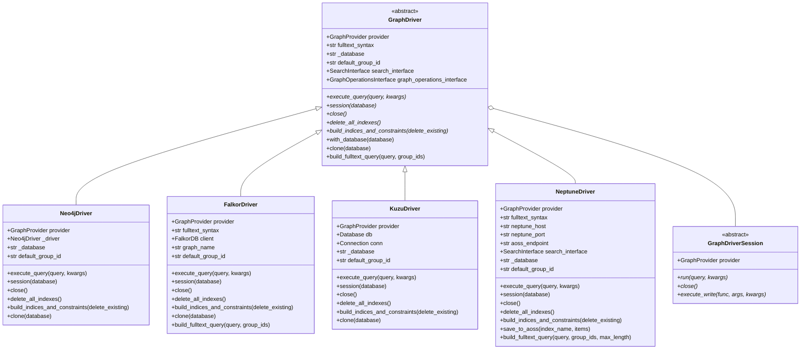
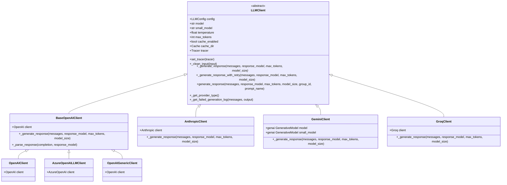
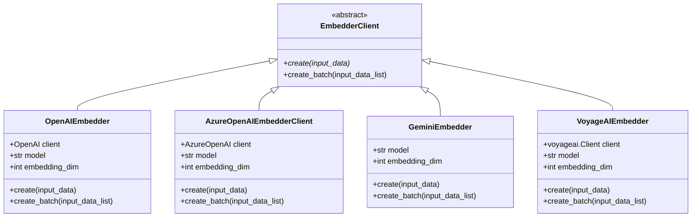
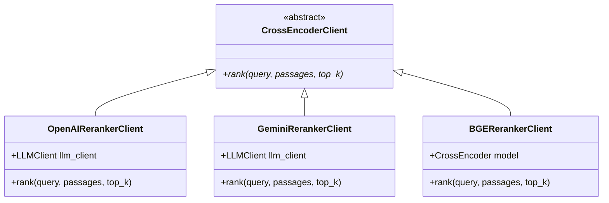
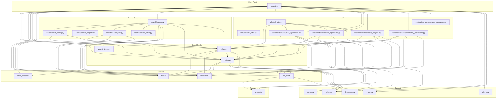
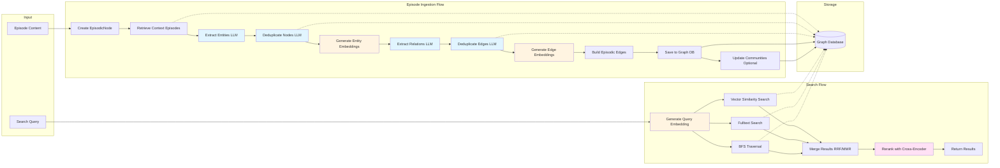

# Architecture Diagrams

## Overview

Graphiti is a temporal knowledge graph system built on Python that provides an advanced framework for managing episodic knowledge with semantic understanding. The architecture follows a layered design pattern with clear separation of concerns:

- **Core Library Layer**: The main `graphiti_core` package containing all business logic
- **Server Layer**: FastAPI-based HTTP server and MCP (Model Context Protocol) server
- **Integration Layer**: Database drivers, LLM clients, embedders, and rerankers
- **Examples Layer**: Demonstration applications showing various use cases

The system is designed around a plugin architecture where different providers (databases, LLMs, embedders) can be swapped through abstract interfaces. The core orchestrates episodic data ingestion, entity/edge extraction, deduplication, and semantic search operations.

## System Architecture

The system is organized into distinct layers that handle different aspects of the knowledge graph lifecycle:

**Layer Descriptions:**

- **Application Layer**: Entry points for using Graphiti (examples, servers, direct library usage)
- **Core Library Layer**: Main business logic orchestrating all operations
- **Data Models Layer**: Pydantic models representing graph entities and search results
- **Operations Layer**: Specialized modules for extraction, deduplication, and maintenance
- **Integration Layer**: Abstract interfaces for pluggable providers
- **Provider Layer**: Concrete implementations of external services

## Component Relationships

This diagram shows how major components interact during the typical episode ingestion workflow:

**Key Interaction Patterns:**

1. **Graphiti orchestration**: The main Graphiti class coordinates all operations through injected client dependencies
2. **Operation layer**: Specialized modules handle node extraction, edge extraction, deduplication, and communities
3. **LLM integration**: Operations use LLM clients with prompt templates for entity/relation extraction
4. **Embedding generation**: Embedders create vector representations for semantic search
5. **Graph persistence**: All operations ultimately read/write through the graph driver abstraction

## Class Hierarchies

### Node Types

**Node Type Descriptions:**

- **Node**: Abstract base class providing common UUID, naming, grouping, and CRUD operations
- **EpisodicNode**: Represents a temporal episode (message, text, JSON) with raw content and temporal metadata
- **EntityNode**: Represents extracted entities with embeddings, summaries, and custom attributes
- **CommunityNode**: Represents clustered groups of related entities with summary descriptions

### Edge Types

**Edge Type Descriptions:**

- **Edge**: Abstract base class with source/target UUIDs and common operations
- **EpisodicEdge**: Links episodic nodes to mentioned entities (MENTIONS relationship)
- **EntityEdge**: Semantic relationships between entities with fact descriptions, embeddings, and temporal validity
- **CommunityEdge**: Links community nodes to their member entities (HAS_MEMBER relationship)

### Database Drivers

**Database Driver Descriptions:**

- **GraphDriver**: Abstract interface defining common graph database operations
- **Neo4jDriver**: Production-ready driver for Neo4j graph database (primary support)
- **FalkorDriver**: Redis-based FalkorDB driver with custom fulltext query syntax
- **KuzuDriver**: Embedded KuzuDB driver with unique edge modeling approach
- **NeptuneDriver**: AWS Neptune driver with OpenSearch integration for fulltext search

### LLM Clients

**LLM Client Descriptions:**

- **LLMClient**: Abstract base with retry logic, caching, input cleaning, and tracing
- **BaseOpenAIClient**: Shared OpenAI SDK logic for response parsing
- **OpenAIClient**: Standard OpenAI API client
- **AzureOpenAILLMClient**: Azure-hosted OpenAI endpoints
- **OpenAIGenericClient**: Generic OpenAI-compatible APIs
- **AnthropicClient**: Claude models (Anthropic)
- **GeminiClient**: Google Gemini models
- **GroqClient**: Groq inference endpoints

### Embedders

**Embedder Descriptions:**

- **EmbedderClient**: Abstract interface for generating vector embeddings
- **OpenAIEmbedder**: OpenAI text-embedding models (default: text-embedding-3-large)
- **AzureOpenAIEmbedderClient**: Azure-hosted OpenAI embeddings
- **GeminiEmbedder**: Google Gemini embedding models
- **VoyageAIEmbedder**: Voyage AI specialized embeddings

### Rerankers (Cross-Encoders)

**Reranker Descriptions:**

- **CrossEncoderClient**: Abstract interface for reranking search results
- **OpenAIRerankerClient**: LLM-based reranking using OpenAI models
- **GeminiRerankerClient**: LLM-based reranking using Gemini models
- **BGERerankerClient**: BAAI/bge-reranker cross-encoder model

## Module Dependencies

This diagram shows the import relationships between major modules in the graphiti_core package:

**Dependency Analysis:**

1. **graphiti.py**: Main orchestrator importing from all major subsystems
2. **nodes.py & edges.py**: Core data models with minimal dependencies (driver, embedder, helpers)
3. **Search subsystem**: Self-contained module for semantic and hybrid search
4. **Utils/maintenance**: Specialized operations for node/edge extraction, deduplication, and communities
5. **Clients**: Provider interfaces (driver, llm_client, embedder, cross_encoder) are independent
6. **Prompts**: Used by LLM client and maintenance operations for structured extraction
7. **Support modules**: Helpers, errors, decorators, telemetry, and tracing used throughout

## Data Flow

This diagram illustrates how data flows through the system during episode ingestion and search:

**Flow Legend:**
- Blue boxes: LLM operations (entity/relation extraction, deduplication)
- Yellow boxes: Embedding operations (vectorization)
- Pink boxes: Reranking operations (cross-encoder scoring)
- Solid arrows: Primary data flow
- Dashed arrows: Database queries

**Episode Ingestion Flow:**

1. **Episode Creation**: Raw content wrapped in EpisodicNode with metadata
2. **Context Retrieval**: Fetch recent episodes for context-aware extraction
3. **Entity Extraction**: LLM identifies entities with types and attributes
4. **Node Deduplication**: LLM merges similar/duplicate entities against existing graph
5. **Entity Embedding**: Generate semantic vectors for entity names
6. **Relation Extraction**: LLM identifies relationships between entities
7. **Edge Deduplication**: LLM merges similar/duplicate relations
8. **Edge Embedding**: Generate semantic vectors for relation facts
9. **Episodic Edge Creation**: Link episode to mentioned entities
10. **Graph Persistence**: Save all nodes and edges to database
11. **Community Update**: Optionally update community summaries

**Search Flow:**

1. **Query Embedding**: Vectorize search query
2. **Vector Search**: Cosine similarity against entity/edge embeddings
3. **Fulltext Search**: Text-based search using database fulltext indexes
4. **BFS Traversal**: Graph traversal from origin nodes
5. **Result Merging**: Combine results using RRF (Reciprocal Rank Fusion) or MMR (Maximal Marginal Relevance)
6. **Reranking**: Cross-encoder scores query-passage pairs for final ranking
7. **Return Results**: SearchResults with nodes and edges

## Key Design Patterns

### 1. Abstract Factory Pattern
The system uses abstract base classes (GraphDriver, LLMClient, EmbedderClient, CrossEncoderClient) with concrete implementations for each provider, allowing runtime provider selection.

### 2. Strategy Pattern
Search configurations (SearchConfig) encapsulate different search strategies (vector, fulltext, BFS) and reranking methods (RRF, MMR, cross-encoder) that can be swapped.

### 3. Repository Pattern
Node and Edge classes have static methods for database operations (get_by_uuid, get_by_group_ids, delete_by_uuids) abstracting persistence logic.

### 4. Decorator Pattern
The `@handle_multiple_group_ids` decorator in graphiti.py handles multi-partition queries by wrapping methods.

### 5. Template Method Pattern
LLMClient defines the retry and caching logic in base class, while subclasses implement `_generate_response()`.

### 6. Dependency Injection
The Graphiti class accepts driver, llm_client, embedder, and cross_encoder as constructor parameters, bundled in GraphitiClients for passing to operations.

## Scalability Considerations

1. **Batch Operations**: `add_episode_bulk()` processes multiple episodes efficiently
2. **Async/Await**: All I/O operations use async for concurrency
3. **Semaphore Limiting**: `semaphore_gather()` controls concurrent operation count
4. **Embedding Batching**: `create_batch()` methods vectorize multiple items in single API call
5. **Graph Partitioning**: `group_id` enables logical graph partitioning
6. **Caching**: LLM responses can be disk-cached to reduce API costs
7. **Provider Choice**: Embedded KuzuDB for small deployments, Neo4j/Neptune for production scale
