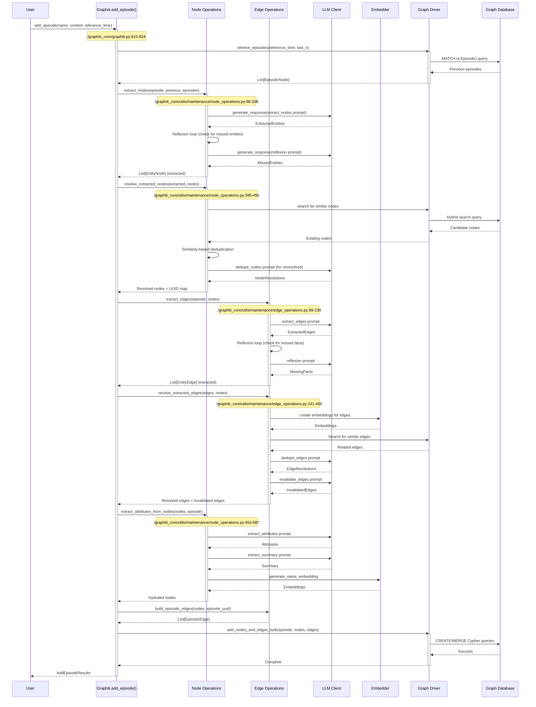
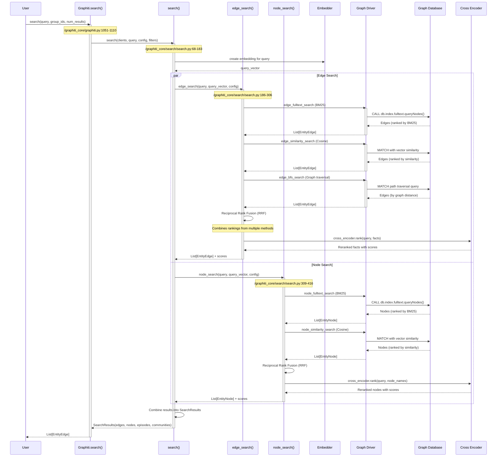
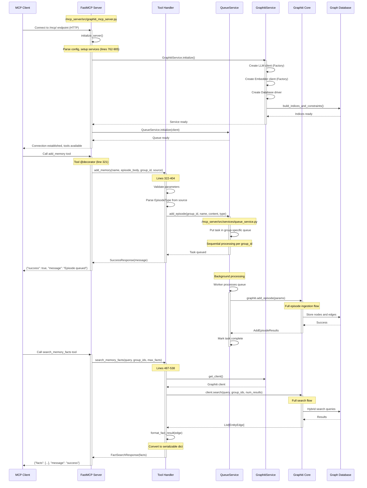
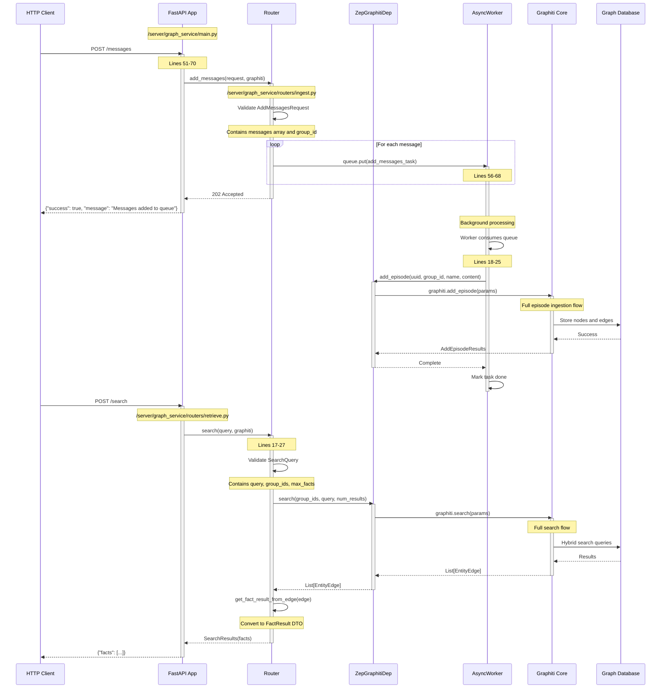
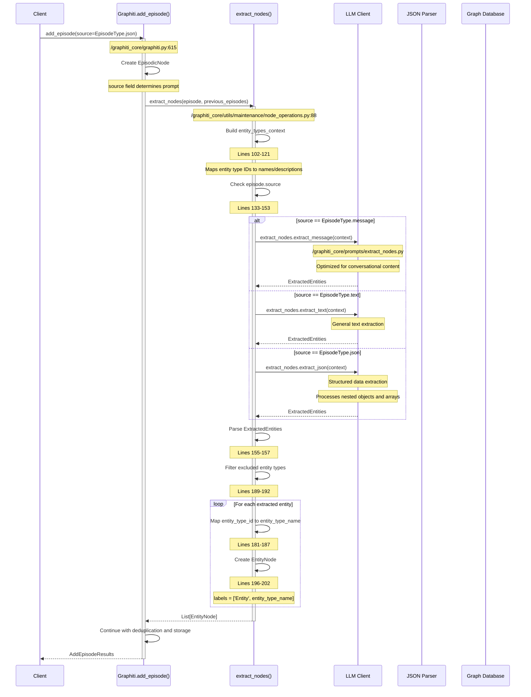
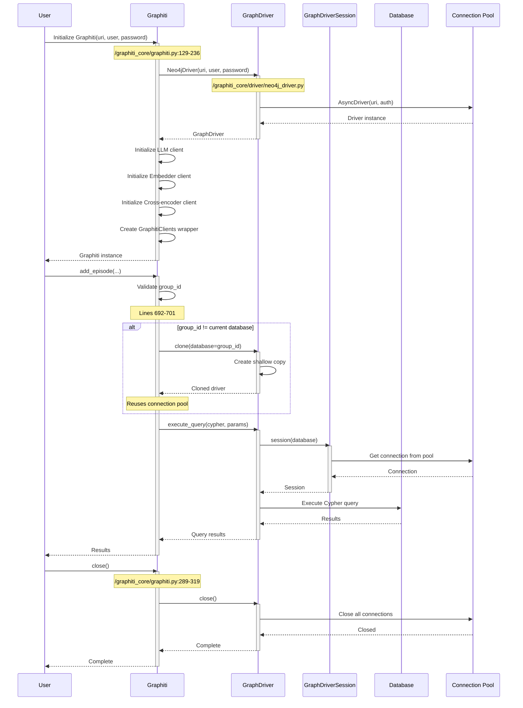

# Data Flow Analysis

## Overview

Graphiti is a temporal knowledge graph system that ingests episodes (text, messages, or JSON), extracts entities and relationships, and provides sophisticated search capabilities. The system is designed with multiple access layers including a core library, HTTP server, and MCP (Model Context Protocol) server.

**Major Data Flows:**

1. **Episode Ingestion Flow** - Episodes enter the system, are processed through entity/edge extraction, deduplication, and stored in the graph database
2. **Search Query Flow** - Queries are embedded, searched across multiple methods (BM25, cosine similarity, BFS), reranked, and results returned
3. **MCP Server Communication Flow** - External tools interact with Graphiti through the MCP protocol
4. **HTTP Server Flow** - REST API endpoints for message ingestion and search
5. **Session Management Flow** - Database connections and async task management

## Episode Ingestion Flow

The episode ingestion flow is the primary data entry point, transforming raw content into a structured knowledge graph.



### Key Steps

1. **Episode Creation** (`/graphiti_core/graphiti.py:718-731`)
   - Create EpisodicNode with name, content, timestamp, source type
   - Store group_id for partitioning
   - Validate entity_types and excluded_entity_types

2. **Context Retrieval** (`/graphiti_core/graphiti.py:706-715`)
   - Retrieve previous N episodes for context
   - Use reference_time to get temporal context
   - Filter by source type if specified

3. **Node Extraction** (`/graphiti_core/utils/maintenance/node_operations.py:88-208`)
   - LLM extracts entities from episode content
   - Reflexion loop validates no entities were missed (up to MAX_REFLEXION_ITERATIONS)
   - Entities classified by entity_type_id
   - Excluded entity types filtered out
   - Each entity becomes an EntityNode with UUID

4. **Node Deduplication** (`/graphiti_core/utils/maintenance/node_operations.py:395-450`)
   - Search for similar existing nodes via hybrid search
   - Similarity-based matching (exact name + embedding distance)
   - LLM-based deduplication for unresolved matches
   - UUID mapping tracks original -> resolved UUIDs
   - Returns resolved nodes and duplicate pairs

5. **Edge Extraction** (`/graphiti_core/utils/maintenance/edge_operations.py:89-238`)
   - LLM extracts relationships (facts) between entities
   - Reflexion loop validates no facts were missed
   - Each edge has source_entity_id, target_entity_id, fact, relation_type
   - Temporal metadata (valid_at, invalid_at) extracted
   - Entity IDs mapped to node UUIDs

6. **Edge Deduplication** (`/graphiti_core/utils/maintenance/edge_operations.py:241-400`)
   - Generate embeddings for extracted edges
   - Search for existing edges between same node pairs
   - LLM deduplicates similar facts
   - LLM identifies invalidated edges (superseded facts)
   - Returns resolved edges + invalidated edges

7. **Attribute Extraction** (`/graphiti_core/utils/maintenance/node_operations.py:453-587`)
   - For each node, extract type-specific attributes
   - Generate summary using LLM
   - Create name embeddings
   - Truncate summaries to MAX_SUMMARY_CHARS

8. **Graph Storage** (`/graphiti_core/utils/bulk_utils.py`)
   - Build episodic edges (episode MENTIONS entity)
   - Bulk insert nodes and edges into database
   - Store embeddings as node/edge properties
   - Update episode with entity_edges list

## Search Query Flow

Search combines multiple retrieval methods and sophisticated reranking to find relevant information.



### Key Steps

1. **Query Entry** (`/graphiti_core/graphiti.py:1051-1110`)
   - Select search config based on parameters (EDGE_HYBRID_SEARCH_RRF or EDGE_HYBRID_SEARCH_NODE_DISTANCE)
   - Set limit for results
   - Pass group_ids for partitioning

2. **Query Embedding** (`/graphiti_core/search/search.py:103-109`)
   - Create embedding vector if needed for cosine similarity
   - Skip if only using BM25
   - Cache vector for multiple search methods

3. **Edge Search - BM25** (`/graphiti_core/search/search_helpers.py`)
   - Fulltext search on edge.fact field
   - Uses database-native fulltext index
   - Returns edges ranked by BM25 score
   - Limit: 2 * requested_limit

4. **Edge Search - Cosine Similarity** (`/graphiti_core/search/search_helpers.py`)
   - Vector similarity search on fact_embedding
   - Uses gds.similarity.cosine in Neo4j
   - Filters by sim_min_score threshold
   - Returns edges ranked by cosine distance

5. **Edge Search - BFS** (`/graphiti_core/search/search_helpers.py`)
   - Breadth-first graph traversal from origin nodes
   - Finds edges within bfs_max_depth hops
   - Useful for localized context around specific entities
   - Returns edges by graph proximity

6. **Node Search Methods** (`/graphiti_core/search/search.py:309-416`)
   - Similar to edge search: BM25, cosine similarity, BFS
   - Searches on node.name and node.summary
   - Uses name_embedding for similarity
   - Episode mentions reranker available

7. **Reciprocal Rank Fusion** (`/graphiti_core/search/search_utils.py`)
   - Combines rankings from multiple search methods
   - Formula: RRF_score = Σ(1/(k + rank_i))
   - k=60 default constant
   - Produces unified ranking

8. **Cross-Encoder Reranking** (`/graphiti_core/search/search.py:269-275`)
   - Semantic reranking using cross-encoder model
   - Scores query-fact pairs
   - Filters by reranker_min_score
   - Returns top-k most relevant results

9. **Result Assembly** (`/graphiti_core/search/search.py:168-177`)
   - Combine edges, nodes, episodes, communities
   - Include reranker scores for each category
   - Apply final limit
   - Return SearchResults object

## MCP Server Communication Flow

The MCP (Model Context Protocol) server exposes Graphiti functionality to external tools and AI agents.



### Key Steps

1. **Server Initialization** (`/mcp_server/src/graphiti_mcp_server.py:762-905`)
   - Parse CLI arguments and YAML config
   - Apply configuration overrides
   - Create LLM client via LLMClientFactory (lines 180-182)
   - Create Embedder client via EmbedderFactory (lines 185-188)
   - Create Database driver via DatabaseDriverFactory (lines 191)
   - Build custom entity types from config (lines 194-210)
   - Initialize Graphiti client with components
   - Build database indices and constraints
   - Initialize QueueService for async processing

2. **Tool Registration** (`/mcp_server/src/graphiti_mcp_server.py:321-753`)
   - @mcp.tool() decorator registers functions
   - Tools: add_memory, search_nodes, search_memory_facts, delete_entity_edge, delete_episode, get_entity_edge, get_episodes, clear_graph, get_status
   - Each tool has type-safe parameters
   - Returns structured response types (SuccessResponse, ErrorResponse, etc.)

3. **Episode Queuing** (`/mcp_server/src/graphiti_mcp_server.py:321-404`)
   - add_memory tool accepts episode data
   - Validates source type (text/json/message)
   - Submits to QueueService for async processing
   - Returns immediately with success message
   - Episodes for same group_id processed sequentially

4. **Queue Processing** (`/mcp_server/src/services/queue_service.py`)
   - Separate queue per group_id (lines 18-98)
   - Worker processes tasks sequentially per group
   - Prevents race conditions on same graph partition
   - Calls graphiti.add_episode with entity_types
   - Handles errors and logs failures

5. **Search Tool** (`/mcp_server/src/graphiti_mcp_server.py:487-538`)
   - search_memory_facts tool
   - Validates max_facts > 0
   - Uses provided group_ids or defaults from config
   - Calls client.search() with parameters
   - Formats edges as fact results
   - Returns FactSearchResponse with list of facts

6. **Node Search Tool** (`/mcp_server/src/graphiti_mcp_server.py:407-484`)
   - search_nodes tool
   - Creates SearchFilters with entity_types
   - Uses NODE_HYBRID_SEARCH_RRF config
   - Returns nodes with attributes (embeddings removed)
   - Includes UUID, name, labels, summary, group_id

7. **Health Check** (`/mcp_server/src/graphiti_mcp_server.py:756-759`)
   - Custom route /health for monitoring
   - Returns {"status": "healthy"}
   - Used by Docker health checks and load balancers

8. **Transport Modes** (`/mcp_server/src/graphiti_mcp_server.py:908-949`)
   - HTTP transport (recommended): streamable HTTP on /mcp/ endpoint
   - STDIO transport: standard input/output for Claude Desktop
   - SSE transport: server-sent events (deprecated)
   - Configuration via CLI or YAML

## HTTP Server Communication Flow

The HTTP server provides a REST API for message ingestion and search, primarily used by the Zep service.



### Key Steps

1. **Application Lifecycle** (`/server/graph_service/main.py:11-18`)
   - Lifespan context manager initializes Graphiti
   - Loads settings from config
   - Calls initialize_graphiti(settings)
   - No explicit shutdown needed (handled per-request)

2. **Router Registration** (`/server/graph_service/main.py:23-24`)
   - Include retrieve router (search endpoints)
   - Include ingest router (message/episode endpoints)
   - Health check endpoint at /healthcheck

3. **Message Ingestion** (`/server/graph_service/routers/ingest.py:51-70`)
   - POST /messages endpoint
   - Accepts AddMessagesRequest with messages array
   - Each message has: uuid, name, role, role_type, content, timestamp, source_description
   - Formatted as "{role}({role_type}): {content}"
   - Queued to AsyncWorker for sequential processing
   - Returns 202 Accepted immediately

4. **AsyncWorker** (`/server/graph_service/routers/ingest.py:13-46`)
   - Single background worker task
   - Consumes asyncio.Queue
   - Processes jobs sequentially
   - Logs queue size
   - Handles cancellation on shutdown

5. **Search Endpoint** (`/server/graph_service/routers/retrieve.py:17-27`)
   - POST /search endpoint
   - Accepts SearchQuery with query, group_ids, max_facts
   - Calls graphiti.search()
   - Converts EntityEdge to FactResult DTO
   - Returns SearchResults with facts array

6. **Get Memory Endpoint** (`/server/graph_service/routers/retrieve.py:44-63`)
   - POST /get-memory endpoint
   - Accepts messages array
   - Composes single query from all messages
   - Calls search with combined query
   - Returns facts relevant to conversation context

7. **Entity Edge Retrieval** (`/server/graph_service/routers/retrieve.py:30-33`)
   - GET /entity-edge/{uuid}
   - Retrieves specific edge by UUID
   - Returns fact result

8. **Episode Retrieval** (`/server/graph_service/routers/retrieve.py:36-41`)
   - GET /episodes/{group_id}
   - Retrieves last N episodes for group
   - Uses datetime.now(timezone.utc) as reference time

9. **Delete Operations** (`/server/graph_service/routers/ingest.py:87-111`)
   - DELETE /entity-edge/{uuid}
   - DELETE /episode/{uuid}
   - DELETE /group/{group_id}
   - POST /clear (clear all data + rebuild indices)

## Message Parsing and Routing

Different episode types (message, text, JSON) are parsed and routed to appropriate extraction prompts.



### Key Steps

1. **Episode Type Detection** (`/graphiti_core/graphiti.py:621`)
   - source parameter: EpisodeType enum (message, text, json)
   - Defaults to message
   - Stored in EpisodicNode.source field

2. **Context Preparation** (`/graphiti_core/utils/maintenance/node_operations.py:123-130`)
   - episode_content: raw content string
   - episode_timestamp: valid_at timestamp
   - previous_episodes: context for coreference resolution
   - entity_types: custom entity type definitions
   - source_description: metadata about source

3. **Message Extraction** (`/graphiti_core/prompts/extract_nodes.py`)
   - prompt_library.extract_nodes.extract_message()
   - Optimized for conversational content
   - Extracts speaker, mentions, topics
   - Handles coreferences ("she", "it", "the company")
   - Returns ExtractedEntities with name, entity_type_id

4. **Text Extraction** (`/graphiti_core/prompts/extract_nodes.py`)
   - prompt_library.extract_nodes.extract_text()
   - General purpose entity extraction
   - Extracts people, organizations, locations, concepts
   - Temporal information extraction
   - Returns ExtractedEntities

5. **JSON Extraction** (`/graphiti_core/prompts/extract_nodes.py`)
   - prompt_library.extract_nodes.extract_json()
   - Structured data processing
   - Nested object traversal
   - Array element extraction
   - Key-value pair interpretation
   - Schema inference
   - Returns ExtractedEntities

6. **Entity Type Mapping** (`/graphiti_core/utils/maintenance/node_operations.py:181-194`)
   - entity_type_id from LLM maps to entity_types_context
   - entity_types_context[0] = 'Entity' (default)
   - Custom types have IDs 1, 2, 3, ...
   - Invalid IDs default to 'Entity'
   - Excluded types filtered out

7. **Node Creation** (`/graphiti_core/utils/maintenance/node_operations.py:196-204`)
   - Create EntityNode with name
   - labels = ['Entity', entity_type_name]
   - group_id from episode
   - UUID auto-generated
   - summary initially empty (filled later)

8. **Edge Extraction** (`/graphiti_core/utils/maintenance/edge_operations.py:122-234`)
   - Context includes nodes with IDs: [{'id': 0, 'name': 'Alice'}, ...]
   - LLM returns source_entity_id and target_entity_id
   - IDs validated against nodes array length
   - Invalid IDs logged and skipped
   - temporal metadata (valid_at, invalid_at) extracted

## Interactive Session Flow

Session management for database connections and async operations.



### Key Steps

1. **Initialization** (`/graphiti_core/graphiti.py:129-236`)
   - Create GraphDriver (Neo4j, FalkorDB, etc.)
   - Initialize LLM client (OpenAI, Anthropic, etc.)
   - Initialize Embedder client (OpenAI, Voyage, etc.)
   - Initialize Cross-encoder client
   - Create Tracer for OpenTelemetry
   - Set tracer on clients
   - Wrap in GraphitiClients container
   - Capture telemetry event

2. **Database Selection** (`/graphiti_core/graphiti.py:692-701`)
   - group_id determines database/graph partition
   - If group_id differs from current database, clone driver
   - Driver.clone() creates shallow copy with different database
   - Reuses same connection pool
   - Updates clients.driver reference

3. **Session Management** (`/graphiti_core/driver/neo4j_driver.py`)
   - Driver.session() creates session for database
   - Sessions are async context managers
   - Connection pooling handled by Neo4j driver
   - Sessions auto-close on context exit

4. **Query Execution** (`/graphiti_core/driver/driver.py:84-85`)
   - execute_query() is abstract method
   - Neo4j: uses driver.execute_query()
   - FalkorDB: uses graph.query()
   - Returns records, summary, keys

5. **Connection Pooling** (Handled by database driver)
   - Neo4j driver maintains async connection pool
   - Pool size configurable via max_connection_pool_size
   - Connections reused across sessions
   - Automatic reconnection on failures

6. **Cleanup** (`/graphiti_core/graphiti.py:289-319`)
   - User calls graphiti.close()
   - Closes driver connection pool
   - Should be called in finally block or context manager
   - Releases database resources

7. **Async Operations** (`/graphiti_core/helpers.py`)
   - semaphore_gather() for concurrent LLM calls
   - SEMAPHORE_LIMIT controls max concurrent operations
   - Prevents rate limit errors
   - Default from environment or function parameter

## Data Transformation Summary

| Stage | Input | Output | Transformation | File Reference |
|-------|-------|--------|----------------|----------------|
| Episode Creation | Raw text/message/JSON | EpisodicNode | Parse content, set metadata, generate UUID | `/graphiti_core/graphiti.py:718-731` |
| Entity Extraction | EpisodicNode + context | List[ExtractedEntity] | LLM extracts entities with types and IDs | `/graphiti_core/utils/maintenance/node_operations.py:88-208` |
| Entity Type Mapping | ExtractedEntity | EntityNode | Map type ID to type name, create labels | `/graphiti_core/utils/maintenance/node_operations.py:181-202` |
| Node Deduplication | List[EntityNode] | Resolved nodes + UUID map | Similarity matching + LLM deduplication | `/graphiti_core/utils/maintenance/node_operations.py:395-450` |
| Edge Extraction | EpisodicNode + nodes | List[ExtractedEdge] | LLM extracts relationships between entity IDs | `/graphiti_core/utils/maintenance/edge_operations.py:89-238` |
| Edge ID Mapping | ExtractedEdge | EntityEdge | Map entity IDs to node UUIDs | `/graphiti_core/utils/maintenance/edge_operations.py:188-234` |
| Edge Deduplication | List[EntityEdge] | Resolved edges + invalidated edges | Embedding similarity + LLM dedup + invalidation | `/graphiti_core/utils/maintenance/edge_operations.py:241-400` |
| UUID Remapping | Edges with old UUIDs | Edges with new UUIDs | Apply UUID map from node deduplication | `/graphiti_core/utils/bulk_utils.py` |
| Attribute Extraction | EntityNode | Hydrated EntityNode | LLM extracts type-specific attributes + summary | `/graphiti_core/utils/maintenance/node_operations.py:453-587` |
| Embedding Generation | EntityNode | EntityNode with embeddings | Embedder creates name_embedding vector | `/graphiti_core/nodes.py` |
| Edge Embedding | EntityEdge | EntityEdge with embeddings | Embedder creates fact_embedding vector | `/graphiti_core/edges.py` |
| Episodic Edge Creation | List[EntityNode] + episode UUID | List[EpisodicEdge] | Create MENTIONS edges from episode to entities | `/graphiti_core/utils/maintenance/edge_operations.py:51-68` |
| Bulk Storage | Nodes + Edges | Database records | Cypher CREATE/MERGE queries | `/graphiti_core/utils/bulk_utils.py` |
| Query Embedding | Text query | Vector | Embedder creates query vector | `/graphiti_core/search/search.py:103-109` |
| Fulltext Search | Query text | Ranked edges/nodes | BM25 scoring on database index | `/graphiti_core/search/search_helpers.py` |
| Vector Search | Query vector | Ranked edges/nodes | Cosine similarity on embeddings | `/graphiti_core/search/search_helpers.py` |
| BFS Search | Origin node UUIDs | Nearby edges/nodes | Graph traversal within max depth | `/graphiti_core/search/search_helpers.py` |
| Reciprocal Rank Fusion | Multiple ranked lists | Unified ranking | RRF formula combines rankings | `/graphiti_core/search/search_utils.py` |
| Cross-Encoder Reranking | Query + candidates | Final ranking + scores | Semantic similarity scoring | `/graphiti_core/search/search.py:269-275` |
| Result Filtering | SearchResults | Limited results | Apply limit, filter by min_score | `/graphiti_core/search/search.py:168-177` |
| DTO Conversion | EntityEdge | FactResult | Extract fact, UUIDs, timestamps, metadata | `/server/graph_service/zep_graphiti.py` |

## Error Handling Flows

Errors are handled at multiple layers with specific strategies:

### 1. Validation Errors

**Location:** `/graphiti_core/graphiti.py:689-690`

```python
validate_entity_types(entity_types)
validate_excluded_entity_types(excluded_entity_types, entity_types)
```

- **Trigger:** Invalid entity type definitions or exclusions
- **Response:** Raise ValueError with descriptive message
- **Propagation:** Bubbles up to caller immediately

### 2. LLM Client Errors

**Location:** `/graphiti_core/llm_client/client.py`

- **Rate Limits:** Handled by tenacity retry decorators
- **Invalid API Keys:** Raise authentication errors
- **Timeout:** Configurable timeout with retry
- **Malformed Responses:** Pydantic validation errors
- **Response:** Log error, retry with exponential backoff (if retryable), or raise

### 3. Database Connection Errors

**Location:** `/mcp_server/src/graphiti_mcp_server.py:241-277`

```python
except Exception as db_error:
    error_msg = str(db_error).lower()
    if 'connection refused' in error_msg:
        raise RuntimeError(
            f'Database Connection Error: {provider} is not running'
        ) from db_error
```

- **Trigger:** Database unavailable or credentials invalid
- **Response:** User-friendly error message with troubleshooting steps
- **Propagation:** Prevents server startup

### 4. Search Errors

**Location:** `/graphiti_core/search/search.py:277-278`

```python
if center_node_uuid is None:
    raise SearchRerankerError('No center node provided for Node Distance reranker')
```

- **Trigger:** Missing required parameter for reranker
- **Response:** Raise specific SearchRerankerError
- **Propagation:** Returns error to user

### 5. Invalid Entity IDs

**Location:** `/graphiti_core/utils/maintenance/edge_operations.py:195-201`

```python
if not (0 <= source_node_idx < len(nodes) and 0 <= target_node_idx < len(nodes)):
    logger.warning(
        f'Invalid entity IDs in edge extraction...'
    )
    continue
```

- **Trigger:** LLM returns out-of-range entity IDs
- **Response:** Log warning, skip invalid edge
- **Recovery:** Continue processing remaining edges

### 6. Malformed LLM Deduplication Responses

**Location:** `/graphiti_core/utils/maintenance/node_operations.py:359-366`

```python
if relative_id not in valid_relative_range:
    logger.warning('Skipping invalid LLM dedupe id...')
    continue

if relative_id in processed_relative_ids:
    logger.warning('Duplicate LLM dedupe id...')
    continue
```

- **Trigger:** LLM returns invalid or duplicate IDs in dedup response
- **Response:** Log warning, skip invalid resolution, continue with remaining
- **Recovery:** Unresolved nodes treated as new entities

### 7. OpenTelemetry Tracing Errors

**Location:** `/graphiti_core/graphiti.py:237-256`

```python
try:
    capture_event('graphiti_initialized', properties)
except Exception:
    # Silently handle telemetry errors
    pass
```

- **Trigger:** Telemetry service unavailable
- **Response:** Silently catch and ignore
- **Rationale:** Telemetry failures shouldn't break core functionality

### 8. Embedding Generation Errors

**Location:** `/graphiti_core/embedder/client.py`

- **Trigger:** Embedder API unavailable or rate limited
- **Response:** Retry with exponential backoff
- **Fallback:** Log error, skip embedding (search will be limited)

### 9. Queue Processing Errors

**Location:** `/mcp_server/src/services/queue_service.py`

- **Trigger:** Error during episode processing in background worker
- **Response:** Log error with full traceback
- **Recovery:** Continue processing remaining queue items
- **Result:** Failed episode not added, but server remains operational

### 10. Missing Nodes/Edges

**Location:** `/graphiti_core/nodes.py`, `/graphiti_core/edges.py`

- **Trigger:** UUID not found in database
- **Response:** Raise exception or return None (depending on method)
- **Propagation:** Caller handles missing data

### Error Propagation Pattern

```
User Request
    ↓
[Validation Layer] → ValueError (immediate failure)
    ↓
[LLM Client Layer] → Retry → LLMClientError (after retries exhausted)
    ↓
[Database Layer] → Retry → DatabaseError (after retries exhausted)
    ↓
[Business Logic Layer] → Log + Continue (for non-critical errors)
    ↓
[API Response Layer] → ErrorResponse DTO
    ↓
User receives error
```

### Critical vs Non-Critical Errors

**Critical (Halt Processing):**
- Database connection failures
- Invalid credentials
- Missing required parameters
- Validation failures

**Non-Critical (Log + Continue):**
- Invalid entity IDs from LLM
- Malformed deduplication responses
- Telemetry failures
- Individual embedding generation failures

**Retryable:**
- Rate limit errors
- Temporary network failures
- Database connection timeouts

This error handling strategy ensures system resilience while providing clear feedback for diagnosable issues.
